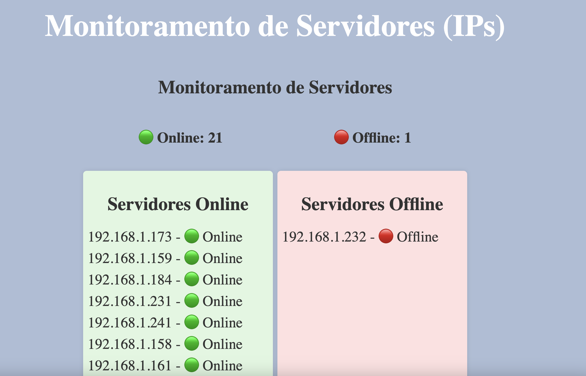

## Monitoramentos de Ips para servidores 



## Front end 
### `npm install`
### `npm start`

Runs the app in the development mode.\
Open [http://localhost:3000](http://localhost:3000) to view it in your browser.

## Back end 
### `npm install`
### `node server.js`

Launches the test runner in the interactive watch mode.\
Open [http://localhost:3001](http://localhost:3001) to view it in your browser.


# Monitoramento de Servidores

Este projeto é um sistema de monitoramento de servidores usando React no frontend e Node.js no backend. O sistema permite visualizar o status dos servidores em tempo real utilizando WebSocket.

## Estrutura do Projeto


## Backend

O backend é responsável por fornecer as informações sobre o status dos servidores e enviar atualizações em tempo real para o frontend via WebSocket.

### Dependências

Certifique-se de ter as seguintes dependências instaladas:
- `express`
- `http`
- `ws`
- `ping`
- `dotenv`

### Configuração do `.env`


## Backend

O backend é responsável por fornecer as informações sobre o status dos servidores e enviar atualizações em tempo real para o frontend via WebSocket.

### Dependências

Certifique-se de ter as seguintes dependências instaladas:
- `express`
- `http`
- `ws`
- `ping`
- `dotenv`

### Configuração do `.env`

Crie um arquivo chamado `.env` na pasta `backend/` com o seguinte conteúdo:

```dotenv
# Configuração do Backend ,(Lembrando que ele le os Ips pela rede , se mudar de rede e outros ips )

# Variáveis para os Servidores 
SERVER_IPS=192.168.1.PORTA,192.168.1.PORTA,


